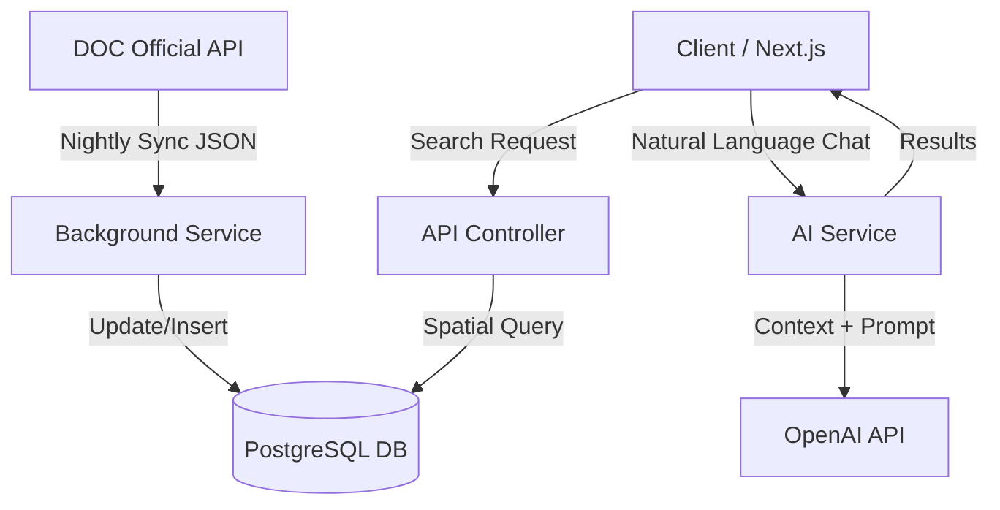

# 🦜 KeaTracks API

-512BD4?style=flat&logo=dotnet)


**KeaTracks** is an intelligent outdoor companion designed to modernize the hiking experience in New Zealand.

This repository (`kea-tracks-api`) contains the **RESTful Backend**, responsible for data aggregation, spatial geospatial querying, AI processing, and business logic. It serves as the "Brain" for the KeaTracks web platform.

## 🚀 Key Features

*   **Official Data Sync:** A background worker service that nightly syncs official track data, alerts, and closures from the **Department of Conservation (DOC) Open API**.
*   **Geospatial Search:** Uses **PostGIS** to perform efficient "Near Me" queries and radius-based filtering.
*   **Kea Scout (AI):** An integrated RAG (Retrieval-Augmented Generation) system using **OpenAI**, allowing users to find tracks using natural language (e.g., *"Find me a shaded walk near Hamilton for my elderly parents"*).
*   **Offline Safety Packs:** Generates PDF safety guides on-the-fly using **QuestPDF** for areas with no cellular coverage.
*   **Community Reviews:** Handles user ratings, photos, and updates.

## 🛠️ Technical Stack

### Core
*   **Framework:** ASP.NET Core 10 (Preview) Web API
*   **Language:** C# (Latest)
*   **Database:** PostgreSQL (with PostGIS extension)
*   **ORM:** Entity Framework Core (Code-First approach)

### Libraries & Tools
*   **AI/LLM:** OpenAI API (GPT-4o-mini)
*   **PDF Generation:** QuestPDF
*   **Scheduling:** `Microsoft.Extensions.Hosting.BackgroundService`
*   **Mapping:** AutoMapper
*   **Documentation:** Swagger / OpenAPI
*   **Testing:** xUnit, Moq (Planned)

---

## 📂 Project Structure

The solution follows a Clean Architecture inspired structure to keep concerns separated.

```text
KeaTracks.API/
├── Controllers/          # API Endpoints (The Entry Point)
├── Data/                 # DbContext and EF Core Configurations
├── Entities/             # Database Models (The Domain)
├── DTOs/                 # Data Transfer Objects (Contracts)
├── Services/             # Business Logic (AI, PDF generation)
│   └── Interfaces/       # Dependency Injection Interfaces
├── BackgroundServices/   # Hosted Services (DOC Data Sync)
├── Migrations/           # EF Core Database Migrations
├── Program.cs            # Dependency Injection & Middleware Setup
└── appsettings.json      # Configuration (Connection Strings, API Keys)
```

## 🔄 Data Flow Architecture

The system uses a Hybrid Data Approach: It relies on static official data for accuracy, but enhances it with AI and dynamic user content.



*   **Ingestion:** The DocSyncService runs every 24 hours. It fetches the latest track data and safety alerts from the government API and upserts them into our local PostgreSQL database.
*   **Querying:** When a user searches, we query our local database (not the government API) to ensure speed (<50ms response) and advanced filtering capabilities.
*   **Intelligence:** When "Kea Scout" is used, the system identifies search parameters from the user's text, queries the DB, and generates a summarized response.

## ⚡ Getting Started

### Prerequisites

*   .NET 10 SDK
*   PostgreSQL (Local or Docker)
*   PostGIS Extension (Recommended for spatial features)

### Local Setup

**Clone the repository**

```bash
git clone https://github.com/yourusername/kea-tracks-api.git
cd kea-tracks-api
```

**Configure Database**

Update appsettings.json with your local Postgres credentials:

```json
"ConnectionStrings": {
  "DefaultConnection": "Host=localhost;Database=kea_tracks_db;Username=postgres;Password=yourpassword"
}
```

**Apply Migrations**

Create the database schema:

```bash
cd KeaTracks.API
dotnet ef database update
```

**Run the API**

```bash
dotnet watch run
```

The API will be available at http://localhost:5xxx.
Swagger UI will launch at http://localhost:5xxx/swagger.

## 📖 API Documentation

The API is fully documented using Swagger/OpenAPI.
Once running locally, visit /swagger/index.html to explore endpoints.

**Core Endpoints:**

*   `GET /api/tracks/nearby?lat={x}&long={y}` - Geo-spatial search.
*   `POST /api/chat/recommend` - AI recommendation engine.
*   `GET /api/tracks/{id}/safety-pack` - Generates PDF download.

## ✅ Testing Strategy

*   **Unit Tests:** Uses xUnit to test individual business logic services (e.g., ensuring the AI prompt generator formats strings correctly).
*   **Integration Tests:** Uses TestServer to spin up an in-memory database and test the full HTTP request pipeline (Controllers -> DB).

## 📜 License

This project is licensed under the MIT License.
